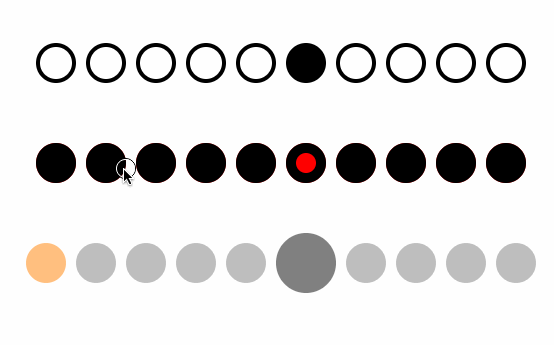

# THEPageControl

*THEPageControl* is a nice page control written in Swift.

<div align="center">

</div>

## Features
- Full control over each dot.
- Horizontal & vertical layouts with optional paddings. Works well with Auto Layout.
- Interactive non-discrete active index change so you can do nice transitions.

## How to use

```swift
let pageControl = PageControl()
pageControl.dots = Array(repeating: .default, count: 10)
pageControl.configuration.spacing = 10

// If you want to customize dots you usually create a new dot style:

extension PageControl.Dot {

    static var customStyle: PageControl.Dot {
        return PageControl.Dot(
            regularStyle: .init(
                radius: 10,
                fillColor: .red,
                strokeColor: .black,
                strokeWidth: 10
            ),
            activeStyle: .init(
                radius: 10,
                fillColor: .red,
                strokeColor: .black,
                strokeWidth: 5
            )
        )
    }
}

// And then you can use the new style to fill `dots` array:

let pageControl = PageControl()
pageControl.dots = [ .default, .customStyle, .default ]
```

## How to install

### Manually
THEPageControl is a single-file component - just copy it into your project!

### CocoaPods
1. Make sure `use_frameworks!` is added to your `Podfile`.
2. Include the following in your `Podfile`:
  ```
  pod 'THEPageControl', '= 1.0.0'
  ```
If you like living on the bleeding edge, you can use the `master` branch with:
  ```
  pod 'THEPageControl', :git => 'https://github.com/badoo/THEPageControl', :branch => 'master'
  ```
3. Run `pod install`

## License
Source code is distributed under MIT license.
